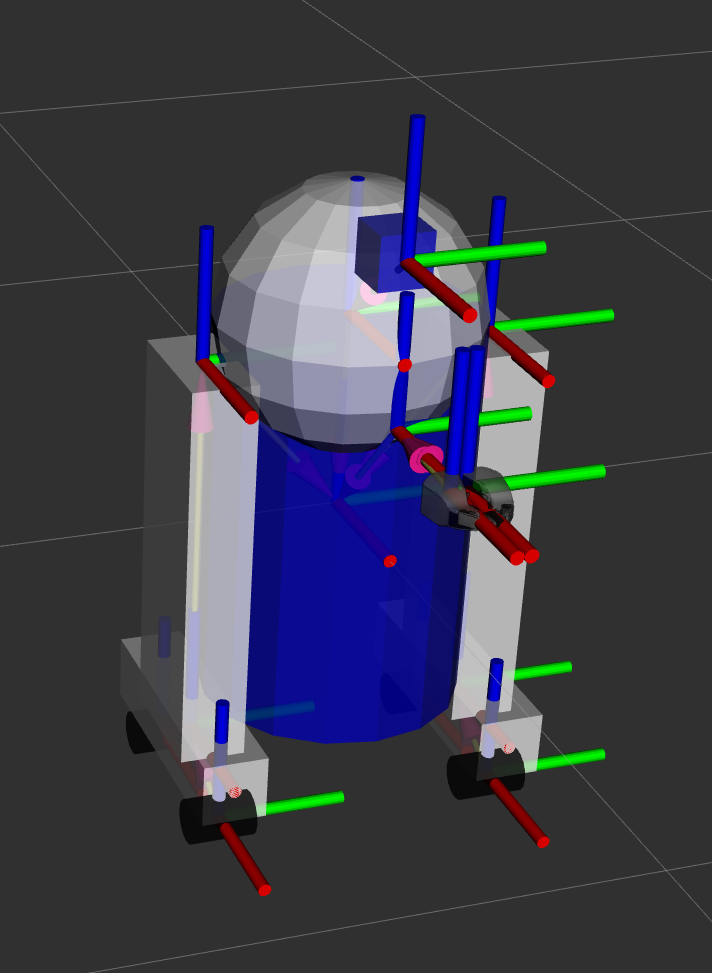
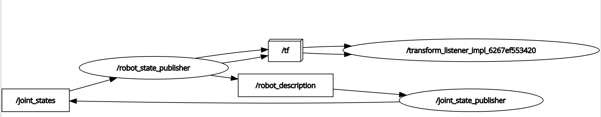

# ROS Visualization Tools



## RViz
This tool is made to visualize robot models in 3D and the transformations ('TFs'). When installing ROS 2 with
```bash
sudo apt install ros-<distro>-desktop
```
you already get RVIZ. Now we also need example tutorials, so we install another package (URDF - 'Unified Robot Description Format') with: 
```bash
sudo apt install ros-<distro>-urdf-tutorials
```
(e.g. we have ROS 2 Jazzy, so we install `ros-jazzy-urdf-tutorials`).

and then there are example robot files in a folder `/opt/ros/jazzy/share/urdf_tutorial/urdf`, which we can start with:
```bash
ros2 launch urdf_tutorial display.launch.py model:=/opt/ros/jazzy/share/urdf_tutorial/urdf/07-physics.urdf 
```
P.S. make sure to use the absolute path to the model file.


Once the RViz is open, you can see the robot model and the TFs. The RobotModel consist of rigid parts (the white and blue parts) and these rigid parts are controlled by the Transformations (TFs), which are the sticks and vectors in the image.

To talk about a robot in a simulations, we need to know the 3 words "Link", "Frame" and "TF". The "Link" is a rigid part of the robot, the "Frame" is the origine of a link and the axis in a coordinate system and the "TF" is a relationship/transformation between two frames.

## Logic
Behind the visualization is actually exactly the logic from [ROS 2](/Ros_terminology.md). Rviz is a node and there is communication between nodes via topics and services. So for example there is a topic for the joint states that interacts with the "Joint State Publisher" and communicates the state of a joint to the rviz node.
.
This can be observed with
```bash
sudo apt install ros-<distro>-tf2-tools
ros2 run tf2_tools view_frames
```
This saves a pdf file with the frames and the TFs like [here](docs/tf_simulation/frames.pdf)
There we clearly see that, when we are interested in the left wheel relative to the base, we would have to compute the transformations from:
- base to left_leg
- left_leg to left_base
- left_base to left_front_wheel

These are 3 transformations that have to be computed for every timestep. That calculation is performed by the tf2 library.